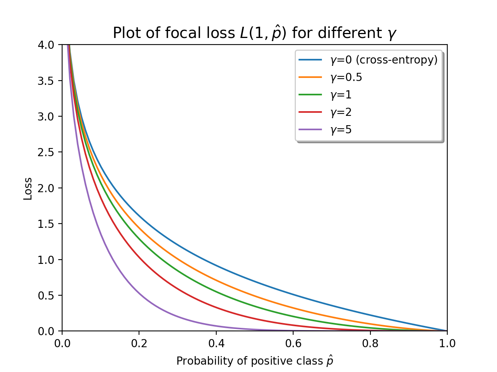

==========
Focal Loss
==========

.. image:: https://img.shields.io/pypi/pyversions/focal-loss
    :target: https://pypi.org/project/focal-loss
    :alt: Python Version

.. image:: https://img.shields.io/pypi/v/focal-loss
    :target: https://pypi.org/project/focal-loss
    :alt: PyPI Package Version

.. image:: https://img.shields.io/github/last-commit/artemmavrin/focal-loss/master
    :target: https://github.com/artemmavrin/focal-loss
    :alt: Last Commit

.. image:: https://travis-ci.com/artemmavrin/focal-loss.svg?branch=master
    :target: https://travis-ci.com/artemmavrin/focal-loss
    :alt: Travis CI Build Status

.. image:: https://github.com/artemmavrin/focal-loss/workflows/Python%20package/badge.svg
    :target: https://github.com/artemmavrin/focal-loss/actions?query=workflow%3A%22Python+package%22
    :alt: GitHub Actions Build Status

.. image:: https://codecov.io/gh/artemmavrin/focal-loss/branch/master/graph/badge.svg
    :target: https://codecov.io/gh/artemmavrin/focal-loss
    :alt: Code Coverage

.. image:: https://readthedocs.org/projects/focal-loss/badge/?version=latest
    :target: https://focal-loss.readthedocs.io/en/latest/
    :alt: Documentation Status

.. image:: https://img.shields.io/github/license/artemmavrin/focal-loss
    :target: https://github.com/artemmavrin/focal-loss/blob/master/LICENSE
    :alt: License

TensorFlow implementation of focal loss [1]_: a loss function generalizing
binary cross-entropy loss that penalizes hard-to-classify examples.

The ``focal_loss`` package provides a function ``binary_focal_loss`` and a class
``BinaryFocalLoss`` that can be used as stand-in replacements for
``tf.keras.losses`` functions and classes, respectively.

.. code-block:: python

    # Typical tf.keras API usage
    import tensorflow as tf
    from focal_loss import BinaryFocalLoss

    model = tf.keras.Model(...)
    model.compile(
        optimizer=...,
        loss=BinaryFocalLoss(gamma=2),  # Used here like a tf.keras loss
        metrics=...,
    )
    history = model.fit(...)

Documentation is available at
`Read the Docs <https://focal-loss.readthedocs.io/en/latest/>`__.

Installation
------------

1.  Make sure that a CPU or GPU version of TensorFlow 2.0 or later is installed
    (see `this link <https://www.tensorflow.org/install>`__ for installation
    instructions).

2.  The ``focal_loss`` package can be installed using the
    `pip <https://pip.pypa.io/en/stable/>`__ utility. For the latest version,
    install directly from the package's
    `GitHub page <https://github.com/artemmavrin/focal-loss>`__:

    .. code-block:: bash

        pip install git+https://github.com/artemmavrin/focal-loss.git

    Alternatively, install a recent release from the
    `Python Package Index (PyPI) <https://pypi.org/project/focal-loss>`__:

    .. code-block:: bash

        pip install focal-loss

    **Note.** To install the project for development (e.g., to make changes to
    the source code), clone the project repository from GitHub and run
    :code:`make dev`:

    .. code-block:: bash

        git clone https://github.com/artemmavrin/focal-loss.git
        cd focal-loss
        # Optional but recommended: create a new Python virtual environment first
        make dev

    This will additionally install the requirements needed
    to run tests, check code coverage, and produce documentation.

References
----------

.. [1] T. Lin, P. Goyal, R. Girshick, K. He and P. Dollár. Focal loss for dense
    object detection. IEEE Transactions on Pattern Analysis and Machine
    Intelligence, 2018. (`DOI <https://doi.org/10.1109/TPAMI.2018.2858826>`__)
    (`arXiv preprint <https://arxiv.org/abs/1708.02002>`__)
